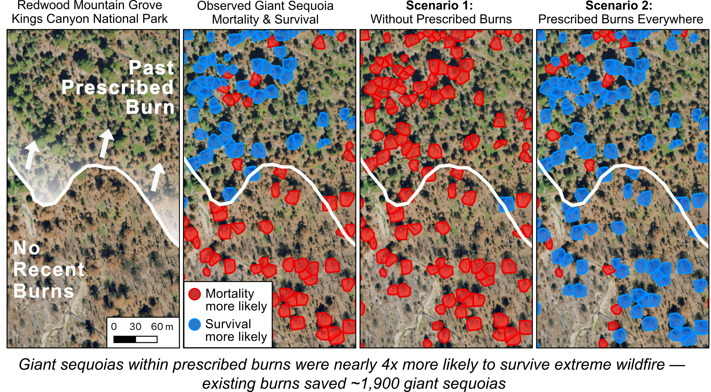

# Sequoia Mortality Analysis

This repository contains the statistical modeling workflow used to estimate giant sequoia (\textit{Sequoiadendron giganteum}) mortality following the 2020 Castle Fire and 2021 KNP Complex wildfire in Sequoia and Kings Canyon National Parks, California, USA.

The analysis combines calibrated tree-level mortality probabilities derived from deep learning classification of PlanetScope imagery with Bayesian hierarchical logistic regression models to evaluate how prescribed fire and forest structure influenced giant sequoia survival during extreme wildfire events.

The repository reproduces the primary analyses, figures, and counterfactual prescribed-fire scenarios presented in:

> Dixon, D.J. et al. *Previous prescribed burns saved thousands of ancient sequoias during historically unprecedented wildfires.*

---


# Study overview

Extreme wildfires during 2020–2021 caused widespread mortality of giant sequoias across the southern Sierra Nevada. Historically, giant sequoia groves persisted under frequent low- to moderate-severity fire regimes that limited fuel accumulation and maintained heterogeneous forest structure. Following more than a century of fire exclusion, fuels accumulated across many groves, increasing vulnerability to high-severity wildfire.

This study evaluates:

- Total giant sequoia mortality following the Castle and KNP Complex wildfires
- The effects of prescribed burning on individual-tree survival
- The influence of lidar-derived forest structure on mortality
- Counterfactual wildfire outcomes under alternative prescribed-fire scenarios



The workflow integrates:

- Giant sequoia stem maps
- PlanetScope satellite imagery
- Airborne lidar
- Prescribed fire history
- Bayesian uncertainty propagation
- Ensemble generalized linear mixed models (GLMMs)

---

# Repository contents

## R workflow

Main modeling scripts are located in:

```text
r/models/
```

Core workflow scripts:

```text
0_calibrate-gamma.R
1_cv-gamma.R
2_simulate-counts.R
3_model-main.R
4_plot-effects.R
5_scenarios.R
```

## Python preprocessing

Python scripts for geospatial preprocessing, lidar processing, crown delineation, and tree-level feature extraction are located in:

```text
python/
```

These scripts were used to:

- Process lidar-derived canopy structure
- Generate giant sequoia crown polygons
- Merge crown polygons with stem locations
- Extract neighborhood forest structure metrics
- Prepare modeling datasets

---

# Analysis workflow

Run scripts from the repository root in the following order.

## 0. Mortality calibration

Calibrates CNN-derived mortality probabilities using independent field observations of giant sequoia mortality and survival.

```bash
Rscript r/models/0_calibrate-gamma.R
```

Outputs calibrated posterior mortality probabilities.

---

## 1. Cross-validation

Performs five-fold cross-validation of the mortality calibration model.

```bash
Rscript r/models/1_cv-gamma.R
```

---

## 2. Mortality simulation

Generates Bernoulli mortality realizations from calibrated posterior mortality probabilities.

```bash
Rscript r/models/2_simulate-counts.R
```

This stage propagates uncertainty from remote sensing classification into downstream analyses.

---

## 3. Ensemble Bayesian GLMMs

Fits ensemble generalized linear mixed models to estimate effects of prescribed burning, lidar-derived forest structure, and topographic covariates on giant sequoia mortality.

```bash
Rscript r/models/3_model-main.R 500 6 FALSE
```

Arguments:

```text
500   = number of ensemble runs
6     = number of CPU cores
FALSE = full analysis mode
```

The GLMM framework includes:

- Bernoulli mortality response
- Logit link function
- Grove-level random intercepts
- Spatially balanced tree subsampling
- Posterior uncertainty propagation

---

## 4. Plotting

Generates effect size plots and posterior summaries.

Run in R:

```r
source("r/models/4_plot-effects.R")
```

---

## 5. Counterfactual prescribed-fire scenarios

Simulates mortality outcomes under alternative management conditions.

```bash
Rscript r/models/5_scenarios.R
```

Scenarios include:

- Observed treatment history
- No prescribed burning
- Universal prescribed burning

---

# Input data

The workflow begins from processed intermediate datasets.

Required files:

```text
data/intermediate/model-trees-Q12-sampled_75m-90m-120m-wgt-median.csv

data/intermediate/stage2-bern_matrix_gamma_6000.rds
```

These processed datasets are archived separately through Zenodo.

Raw lidar, PlanetScope imagery, and proprietary spatial datasets are not distributed within this repository.

---

# Outputs

Model outputs are written to:

```text
results/tables/
results/figures/
```

Typical outputs include:

- Posterior effect estimates
- Mortality summaries
- Scenario simulations
- Grove-level statistics
- Publication figures

---

# Main findings

Across 19 giant sequoia groves containing 26,403 mapped trees:

- Estimated mortality was approximately 8,000 giant sequoias
- Prescribed burning reduced mortality odds by approximately 77%
- Existing prescribed burns prevented approximately 1,900 sequoia deaths
- Universal prescribed burning could have prevented approximately 3,900 additional deaths

These estimates were generated using posterior distributions propagated through all stages of the Bayesian workflow.

---

# Statistical framework

The analysis uses a Bayesian hierarchical logistic regression framework.

Response variable:

- Tree mortality (Bernoulli)

Primary predictors:

- Prescribed fire history
- Canopy density
- Height heterogeneity
- Ladder fuels
- Tree height
- Topographic variables
- Upslope fire exposure

Random effects:

- Grove-level intercepts

The ensemble approach repeatedly resamples trees and posterior mortality realizations to propagate uncertainty from classification, spatial sampling, and model estimation.

---

# Runtime notes

Typical runtime characteristics:

- Full ensemble runs may require several hours
- Parallel execution is recommended
- Small ensemble sizes are intended only for testing

Example:

```bash
Rscript r/models/3_model-main.R 10 2 TRUE
```

---

# Reproducibility

Run all scripts from the repository root directory.

The workflow assumes the repository structure is preserved.

Intermediate files can be regenerated from upstream processing steps.

---

# Data availability

Processed datasets required to reproduce the analyses are archived separately through Zenodo.

Raw PlanetScope imagery is available under license from Planet Labs.

Some source spatial datasets are subject to access restrictions or agency ownership.

---

# Code availability

The complete modeling and preprocessing workflow is available in this repository.

The archived release associated with the manuscript is available through Zenodo.

---

# License

Code in this repository is released under the MIT License unless otherwise noted.

---

# Acknowledgments

This work was supported by NASA Land Cover and Land Use Change Program grant 80NSSC21K0295, the California Strategic Growth Council, USDA NIFA Hatch Project CA-DLAW-2620-H, the U.S. Geological Survey, and the National Park Service.

PlanetScope imagery was provided through the NASA Commercial SmallSat Data Acquisition Program.